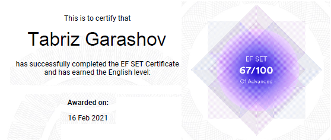

# Tabriz Garashov

## Junior Frontend Developer

### contacts

Github: [tabrizqw](https://github.com/tabrizqw)  
Discord: @tabrizqw

### about me

I am a beginner frontend developer. I want to learn all the necessary skills to become a junior frontend developer. I am eager to learn new information and willing to put in effort. I have no working experience at the moment.

### skills

- HTML5, CSS3
- Git, Github
- JavaScript

### code example

```js
function even_or_odd(number) {
  return number % 2 === 0 ? "Even" : "Odd";
}
```

### courses

- freeCodeCamp, Responsive Web Design - **in progress**.

### languages

- Russian - native
- English - C1 Advanced  
  
